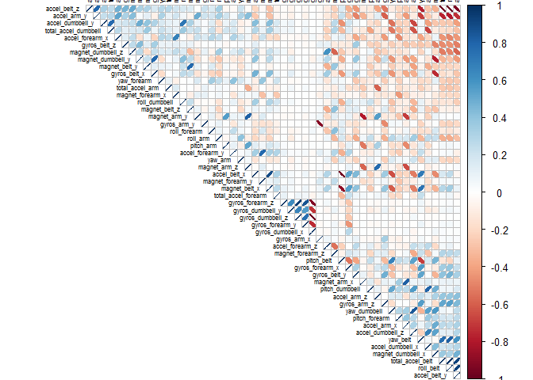

# Practical Machine Learning: Writeup

I will use the package **Caret** for predictive machine learning study.

```r
library(caret)
```

```
## Loading required package: lattice
## Loading required package: ggplot2
```

```r
library(corrplot)
library(kernlab)
library(randomForest)
```

```
## randomForest 4.6-10
## Type rfNews() to see new features/changes/bug fixes.
```

## Loading and cleaning data

The following data will be used for analysis:

```r
if (!file.exists("pml-training.csv")) {
  urlTraining <- "https://d396qusza40orc.cloudfront.net/predmachlearn/pml-training.csv"
  urlTesting <- "https://d396qusza40orc.cloudfront.net/predmachlearn/pml-testing.csv"
  
  download.file(urlTraining , destfile = "pml-training.csv")
  download.file(urlTesting , destfile = "pml-testing.csv")
}
```

Loading raw data from the file:

```r
rawTraining <- read.csv("pml-training.csv", na.strings= c("NA",""," "))
rawTesting <- read.csv("pml-testing.csv", na.strings= c("NA",""," "))
```

Removing columns with missing data in it, or if it is not numeric:

```r
Training <- rawTraining[, colSums(is.na(rawTraining)) == 0] 
Testing <- rawTesting[, colSums(is.na(rawTraining)) == 0]
NumCols <- sapply(Training, is.numeric)
NumCols["classe"] <- TRUE
NumCols["raw_timestamp_part_1"] <- FALSE
NumCols["raw_timestamp_part_2"] <- FALSE
NumCols["X"] <- FALSE
NumCols["num_window"] <- FALSE
Training <- Training[, NumCols] 
Testing <- Testing[, NumCols]
# View(Training[1:20,]) 
```

## Slicing Data

I will use 80% of data as a training sample and the rest of data will be used for cross valudation:

```r
inTrain <- createDataPartition(y = Training$classe, p = 0.8, list = FALSE)
trainingSet <- Training[inTrain, ]
crossVal <- Training[-inTrain, ]
correlMatrix <- cor(trainingSet[, -length(trainingSet)])
corrplot(correlMatrix, order="FPC", method="ellipse", type="upper", tl.col="black", tl.cex=0.5)
```

 

Then I run *random forest method* to create a model and build the confusion matrix for it: 

```r
model <- randomForest(classe ~ ., data = trainingSet)
predictCrossVal <- predict(model, crossVal)
confusionMatrix(crossVal$classe, predictCrossVal)
```

```
## Confusion Matrix and Statistics
## 
##           Reference
## Prediction    A    B    C    D    E
##          A 1116    0    0    0    0
##          B    4  755    0    0    0
##          C    0    6  678    0    0
##          D    0    0    8  635    0
##          E    0    0    0    2  719
## 
## Overall Statistics
##                                           
##                Accuracy : 0.9949          
##                  95% CI : (0.9921, 0.9969)
##     No Information Rate : 0.2855          
##     P-Value [Acc > NIR] : < 2.2e-16       
##                                           
##                   Kappa : 0.9936          
##  Mcnemar's Test P-Value : NA              
## 
## Statistics by Class:
## 
##                      Class: A Class: B Class: C Class: D Class: E
## Sensitivity            0.9964   0.9921   0.9883   0.9969   1.0000
## Specificity            1.0000   0.9987   0.9981   0.9976   0.9994
## Pos Pred Value         1.0000   0.9947   0.9912   0.9876   0.9972
## Neg Pred Value         0.9986   0.9981   0.9975   0.9994   1.0000
## Prevalence             0.2855   0.1940   0.1749   0.1624   0.1833
## Detection Rate         0.2845   0.1925   0.1728   0.1619   0.1833
## Detection Prevalence   0.2845   0.1935   0.1744   0.1639   0.1838
## Balanced Accuracy      0.9982   0.9954   0.9932   0.9972   0.9997
```

Then, predict the classes of the test set:

```
##  1  2  3  4  5  6  7  8  9 10 11 12 13 14 15 16 17 18 19 20 
##  B  A  B  A  A  E  D  B  A  A  B  C  B  A  E  E  A  B  B  B 
## Levels: A B C D E
```

The following code will run the model and save results into the file:

