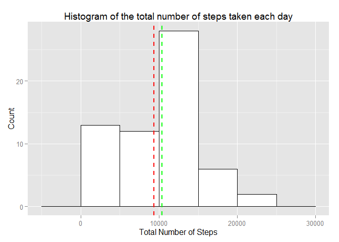
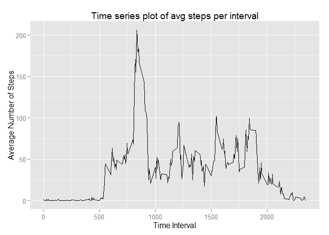
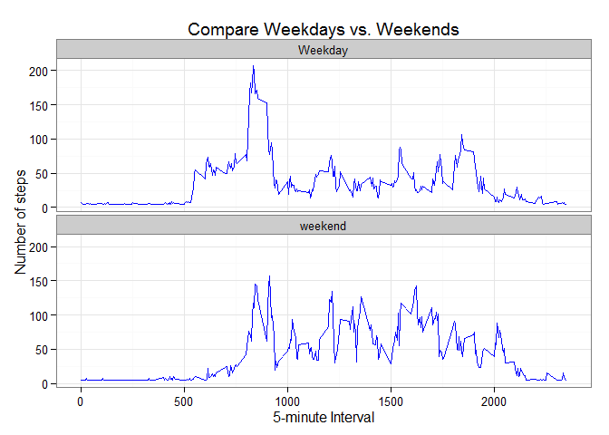

# Reproducible Research: Peer Assessment 1


### Loading and preprocessing the data
Loading and preprocessing the data, just make sure it exists and unzip if needed:

```r
if (!file.exists("activity.zip")) {
  stop("File Activity.zip does not exist")
}
if (!file.exists("activity.csv")) {
  unzip("activity.zip")
}
activity <- read.csv("activity.csv", na.strings="NA")
#it will be needed to use weekday/weekend function:
activity$date <- as.Date(activity$date, format="%Y-%m-%d")
```

### What is mean total number of steps taken per day?
For calculating the average total number of steps taken per day we ignore the missing values in the dataset. 

#### Histogram of the total number of steps taken each day
Then I draw a histogram of the total number of steps taken each day. 

```r
require(plyr) # required for ddply
```

```
## Loading required package: plyr
```

```r
require(ggplot2)
```

```
## Loading required package: ggplot2
```

```r
sum_steps_by_date <- ddply(activity, .(date), summarize, total_steps=sum(steps, na.rm=T))
ggplot(sum_steps_by_date, aes(x=total_steps)) + geom_histogram(binwidth=5000, colour="black", fill="white") + geom_vline(aes(xintercept=mean(total_steps, na.rm=T)), color="red", linetype="dashed", size=1) + xlab("Total Number of Steps") + geom_vline(aes(xintercept=median(total_steps, na.rm=T)), color="green", linetype="dashed", size=1) + xlab("Total Number of Steps") + ylab("Count") +  ggtitle ("Histogram of the total number of steps taken each day")
```

 

#### Mean and Median
Then I calculate and the mean and median of the total number of steps taken per day:

```r
steps_mean <- mean(sum_steps_by_date$total_steps, na.rm=T)
steps_median <- median(sum_steps_by_date$total_steps, na.rm=T)
```
The mean and median of the total number of steps taken per day are **9354 steps** and **10395 steps** respectively.

## What is the average daily activity pattern?

The below is a time series plot of the 5-minute interval (x-axis) and the average number of steps taken, averaged across all days (y-axis):

```r
sum_steps_by_interval <- ddply(activity, .(interval), summarize, avg_steps=mean(steps, na.rm=T))
ggplot(sum_steps_by_interval, aes(interval, avg_steps)) + geom_line() + xlab("Time Interval") + ylab("Average Number of Steps")  +  ggtitle ("Time series plot of avg steps per interval")
```

 

#### Interval containing the maximum number of steps
Then I determine which 5-minute interval, on average across all the days in the dataset, contains the maximum number of steps:

```r
interval_with_max_steps <- sum_steps_by_interval[sum_steps_by_interval$avg_steps==max(sum_steps_by_interval$avg_steps, na.rm=T),'interval']
print (interval_with_max_steps)
```

```
## [1] 835
```
The interval 835 contains the maximum number of steps.

## Imputing missing values

First, I calculate and the total number of missing values in the dataset:

```r
activity_missing_values <- activity[is.na(activity$steps) | is.na(activity$date) | is.na(activity$interval),]
nrow(activity_missing_values)
```

```
## [1] 2304
```
the total number of rows with NAs is 2304

### Strategy for imputing missing data
I use the following strategy for filling in all of the missing values in the dataset: replace NA with the mean for that day rounded to an integer value, or *mean of means* (also rounded to an integer value) if all values for a date are missing.

```r
steps_by_date <- ddply(activity, .(date), summarize, avg_steps=mean(steps, na.rm=T))
steps_by_date$avg_steps <- as.integer(steps_by_date$avg_steps)
mean_of_mean <- as.integer(mean(steps_by_date$avg_steps, na.rm=TRUE))
dates_with_na <- is.na(steps_by_date$avg_steps)
steps_by_date[dates_with_na,]$avg_steps <- rep(mean_of_mean, nrow(steps_by_date[dates_with_na,]))
```

Then I created a new dataset *m* that is equal to the original dataset but with the missing data filled in.

```r
m <- merge(activity, steps_by_date, by.x=c("date"), by.y=c("date"))
m$steps <- ifelse(is.na(m$steps), m$avg_steps, m$steps)
m$avg_steps <- NULL
head(m)
```

```
##         date steps interval
## 1 2012-10-01    36        0
## 2 2012-10-01    36        5
## 3 2012-10-01    36       10
## 4 2012-10-01    36       15
## 5 2012-10-01    36       20
## 6 2012-10-01    36       25
```

### Histogram of steps/day after missing values were imputed
The below is the histogram of the total number of steps taken each day based on the dataset after missing values were imputed. 

```r
total_by_date <- ddply(m, .(date), summarize, total_steps=sum(steps, na.rm=T))
ggplot(total_by_date, aes(x=total_steps)) + geom_histogram(binwidth=5000, colour="black", fill="white") + geom_vline(aes(xintercept=mean(total_steps, na.rm=T)), color="red", linetype="dashed", size=1) + geom_vline(aes(xintercept=median(total_steps, na.rm=T)), color="green", linetype="dashed", size=1) + xlab("Total Number of Steps") + ylab("Count") + ggtitle("Histogram of steps/day after missing values were imputed")
```

 

Then I calculate and the mean and median of the total number of steps taken per day *of the dataset with imputed missing values*:

```r
imp_steps_mean <- as.integer(mean(total_by_date$total_steps, na.rm=T))
imp_steps_median <- median(total_by_date$total_steps, na.rm=T)
```
The mean and the median of the total number of steps taken per day are **10713 steps** and **10395 steps** respectively. Imputing missing data led to increas of the estimates of the total daily number of steps, howerver the median remains same (as before the missing data were imputed).


## Are there differences in activity patterns between weekdays and weekends?
The I use the following *panel plot* in order to compare the average number of steps taken per 5-minute interval across weekdays and weekends:

```r
m$wd <- 'Weekday'
m$wd <- ifelse((weekdays(m$date)=='Saturday'|weekdays(m$date)=='Sunday'), 'weekend', m$wd)
steps_by_wd <- ddply(m, .(wd, interval), summarize, avg_steps=mean(steps, na.rm=T))
ggplot(steps_by_wd, aes(x=interval, y=avg_steps)) + geom_line(color="blue") + facet_wrap(~ wd, nrow=2, ncol=1) + labs(x="5-minute Interval", y="Number of steps") + theme_bw() + ggtitle("Panel plot to compare weekdays vs. weekends")
```

 

#### Compare weekend/weekday activity
Weekday activity appeared higher on lower intervals, but the weekend activity is higher (or almost same) on higher intervals.

